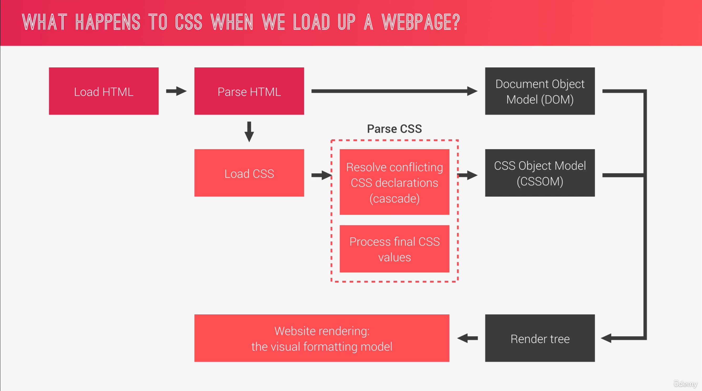
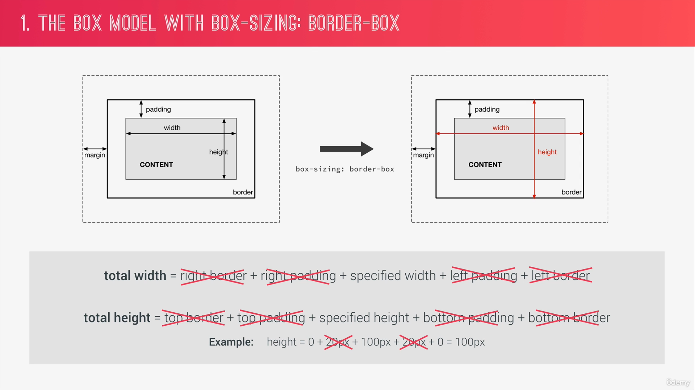

> I'm Zaw Linn Tun a Frontend Web Developer on [Zaw Linn Tun](https://www.facebook.com/zawlinn.profile). :heart:

<br>

## Languages &mdash;

<!--  -->

What I use packages are &mdash;

[](https://skillicons.dev)

<br>

## How CSS Works &mdash; A Look Behind the Scenes

### Three Pillars To Write Good HTML and CSS &mdash;

1. Responsive Design
2. Maintainable and scalable code
3. Web Performance

### Responsive Design

ကိုယ့်ရဲ့ website က responsive ဖြစ်မို့လိုအပ်တယ်။

1. Fluid layouts
2. Media Queries
3. Responsive Images
4. Correct units
5. Desktop-first vs mobile-first

### Maintainable and Scalable Code

ကိုယ်ရေးထားတဲ့ code က ရှင်းလင်းပီး သပ်ရပ်နေမို့လိုတယ်။ ဒါမှာ အခြား developer တွေအတွက် code ဖြည်တဲ့အခါဖြစ်စေ၊ code တွေ ထပ်ပြီး ဖြည့်တဲ့အခါဖြစ်စေ လွယ်ကူစေမှာ ဖြစ်ပါတယ်။ file တွေကို ဘယ်လို organize လုပ်မလဲ သေချာစဉ်းစားရပါမယ်။

1. Clean
2. Easy-to-Understand
3. Growth
4. Reusable
5. How to organize files
6. How to name classes
7. How to structure HTML

### Web performance

web performance ဆိုတာ desktop site ပဲဖြစ်ဖြစ် mobile app ပဲပဲ ဖိုင်ဆိုဒ် သေးအောင် ပြုလုပ်ပေးခြင်းဖြစ်ပါတယ်။ ဒါမှာ user က data နည်းနည်းပဲ အသုံးပြုရမှာဖြစ်ပါတယ်။

1. Less HTTP requests
2. Less code
3. Compress code
4. Use a CSS perprocessor
5. Less images
6. Compress images

## What Happens to CSS When We Load Up a Webpage?



1. ပထမဆုံး HTML ကို စတင် load လုပ်တယ်။ ပီတဲ့အခါမှာ code တွေကို parse လုပ်ပီး `Document Object Model` ဆိုတဲ့ `DOM` ထဲသိမ်းတယ်။ သူမှာ `DOM Tree `နဲ့ အလုပ်လုပ်ပါတယ်။

2. HTML ကို parse လုပ်ရင်း head tag ထဲက css ကို တွေတော့ load လုပ်ပီး သူကိုလည်း parse လုပ်ပါတဲ့အခါ
   1. Resolve conflicting CSS declarations(cascade)
   2. Process final CSS values ဆိုပြီး process နှစ်ခုနဲ့ parse လုပ်ပါတယ်။ ပီးနောက် `CSS Object Model (CSSOM)` ထဲ ထည့်သိမ်းပါတယ်။

3. ပြီးတဲ့အခါမှာ DOM နဲ့ CSSOM ကို ပေါင်းပြီး `Render Tree` ကို တည်ဆောက်ပါတယ်။

4. `Render Tree` ရတဲ့အခါ browser က the `visual Formatting model` ကို အသုံးပြုပီး website ကို rendering ပြုလုပ်ပေးပီးတဲ့အခါ ကျတော်တို့အတွက် လှပတဲ့ webpage အနေနဲ့ browser မှာ ဖော်ပြပေးပါတယ်။

```css
.my_class {
  color: blue;
  text-align: center;
  font-size: 20px;
  /*
    my_class ဆိုတာ selector
    {} က Declaration block
     font-size: 20px; ဆိုတာ declaration
     font-size က property 
     20px က value

*/
}
```

အထက်ပါ CSS ကို author declaration လိုခေါ်ပါတယ်။

Cascade ဆိုတာ မတူညီသာ file တွေမျာ ကြေငြာထားတဲ့ အထပ်ထပ်အကာကာဖိနေတဲ့ CSS code တွေကို ဖြေရှင်းပေးရတဲ့ process ဖြစ်ပါတယ်။ ဆိုလိုတာက el တစ်ခုကို မတူညီသော ဖိုင်တွေမှာ တူညီတဲ့ property တွေ အထပ်ထပ်အခါခါ ပေးထားတတ်တယ်။ ဒီလိုအခါမှာ ဘယ် CSS rule က အဲ့ဒီ el ပေါ် သက်ရောက်မလဲဆိုတာ cascade က ဆုံးဖြတ်ပေးရတာဖြစ်ပါတယ်။

CSS Declaration တွေအများကြီးရှိပါတယ်။

1. Author Declaration
2. User Declaration (User change browser font and theme)
3. Default Declaration (Browser)

cascading က အချက်သုံးချက်ကို အသုံးပြု၍ အလုပ်လုပ်ပါတယ်။

```
    Importance(weight) -> Specificity -> Source Order
```

### Importance

1. User `!important` declarations
2. Author `important` declarations
3. Author declarations
4. User declarations
5. Default browser declarations

### Sepcificity

1. inline Styles
2. IDs
3. Classes, pseudo-classes, attribute
4. Elements, pseudo-elements

(0, 0, 0, 0)
(inline, IDs, Classes, Elements)

### Source Order

အကယ်၍
importance လည်းမပါဘူး specificity လည်းတူနေခဲ့ရင်

နောက်မှရေးတဲ့ code က အလုပ်လုပ်ပါမယ်။

### Summaries

- CSS declarations marked with `!important` have the highest priority;

- But only use `!important` as a last resource. It's better to use correct specificities &mdash; `More Maintainable code!`

- Inline Styles will always have priority over styles in external stylesheets;

- A selector will always have priority over styles in external stylesheets;

- A selector that contains `1` ID is more specific than one with `100` classes;

- A selector that contains `1` class is more specific than one with `10` elements;

- The universal selector \* has no specificity value (0,0,0,0)

- Rely more on specificity than on the order of selectors;

- But, rely on order when using 3rd-party stylesheets &mdash; always but your author stylesheet last.

## How CSS Values are processed &mdash;

px မဟုတ်ဘဲ %, rem, em and vh/vw အစရှိသော unit တွေကို အသုံးပြုထားတယ်ဆိုရင် px အဖြစ် ပြောင်းလဲပေးရမှာ ဖြစ်ပါတယ်။ ဒီနေရာမှာ css parse ရဲ့ ဒုတိယအဆင့် စတင်အသက်ဝင်ပါပြီး

```html
<div class="section">
  <p class="amazing">CSS is absolutely amazing</p>
</div>
```

```css
.section {
  font-size: 1.5rem;
  width: 280px;
  background-color: orangered;
}

p {
  width: 140px;
  background-color: green;
}

.amazing {
  width: 66%;
}
```

| Type of declaration                                           |         width         |      padding       |       font-size       |  font-size   |                 font-size                 |
| ------------------------------------------------------------- | :-------------------: | :----------------: | :-------------------: | :----------: | :---------------------------------------: |
|                                                               |       paragraph       |     paragraph      |         root          |   section    |                 paragraph                 |
| --                                                            |          --           |         --         |          --           |      --      |                    --                     |
| 1. Declared value(author declaration)                         |       140px/66%       |         -          |           -           |    1.5rem    |                     -                     |
| 2. Cascaded value(after the cascade)                          |          66%          |         -          | 16px(browser default) |    1.5rem    |                     -                     |
| 3. Sepecified value(defaulting if there is no cascaded value) |          66%          | 0px(initial value) |         16px          |    1.5rem    | 24px (inheritance from section font-size) |
| 4. Computed value(converting relative value to absolute)      |          66%          |        0px         |         16px          | 24px(1.5x16) |                   24px                    |
| 5. Used value(final calculations, base on layout)             | 184.8px(66% of 280px) |        0px         |         16px          |     24px     |                   24px                    |
| 6. Actual value(browser and device restrictions)              |         185px         |        0px         |         16px          |     24px     |                   24px                    |

## How units are converted from relative to absolute (px)

```css
html,
body {
  font-size: 16px;
  width: 80vw;
}

header {
  font-size: 150%;
  padding: 2em;
  margin-bottom: 10rem;
  height: 90vh;
  width: 1000px;
}

.header-child {
  font-size: 3em;
  padding: 10%;
}
```

|   Units    | Example(x) | How to convert to pixels                |         Result in pixels          |
| :--------: | :--------: | :-------------------------------------- | :-------------------------------: |
|  %(fonts)  |    150%    | x% \* parent's computed font-size       |               24px                |
| %(length)  |    10%     | x% \* parent's computed width           |               100px               |
|  em(font)  |    3em     | x \* parent computed font-size          |           72px(3 \* 24)           |
| em(length) |    2em     | x \* current element computed font-size |           48px(2 \* 24)           |
|    rem     |   10rem    | x \* root computed font-size            |               160px               |
|     vh     |    90vh    | x \* 1% of viewport height              | 90%of the current viewport height |
|     vw     |            | x \* 1% of viewport width               | 90%of the current viewport width  |

> em(font), em(length) and rem are font-based. em reference parent or computed font-size and rem reference root font-size

## Summary

- css value တစ်ခုမှာမကြေငြာထားရင် သို့ inherit value မရှိခဲ့ရင် initial value (default browser) ကို အသုံးပြုပါတယ်။

- Broswer က default သတ်မှတ်ထားပေးတဲ့ root font-size က 16px ဖြစ်ပါတယ်။

- `%` and ralative value အားလုံးကို px ပြောင်းပီး အလုပ်လုပ်ပါတယ်။

- `%` ကို font-size မှာ သုံးမယ်ဆိုရင် parent's font-size ကို မှီခိုပါတယ်။

- `%` ကို length မှာ သုံးမယ်ဆိုရင်တော့ parent's width အပေါ် မှီခိုပါတယ်။

- `em` ကို font-size မှာ သုံးမယ်ဆိုရင် parent's font-size ကို မှီခိုပါတယ်။

- `em` ကို length မှာ သုံးမယ်ဆိုရင် current font-size အပေါ် မှီခိုပါတယ်။

- `rem` ကတော့ root font-size အပေါ် မှီခိုပါတယ်။

- `vh` and `vw` ကတော့ viewport ရဲ့ width and height ပေါ် မှီခိုပါတယ်။

### Inheritance in CSS

```css
.partent {
  font-size: 20px;
  line-height: 150%;
}

.child {
  font-size: 25px;
}
```

```
          Every CSS property must have a value

                          |

              Is there a cascadeed value
            /                           \
          Yes                           NO
           |                             |
    Specified Value               Is the property inherited?
          =                      (specific to each property)
    Cascaded value                                          \
                                                            Yes
                                                             |
                                                      Specified value
                                                             =
                                              Computed value of parent element
```

- Inheritance passes the values for some specific properties from parents to children &mdash; more maintainable code.

- Propeties related to text are inherited: `font-family`, `font-size`, `color`, etc: (`margin`, `padding` are not)

- The computed value of a property is what gets inherited, `not` the declard value.

- inheritance of a property only works if no one declares a value for that property;

- The `inherit` keyword forces inheritance on a certain property.

- The `initial` keyword resets a property to its initial value.

## The Virtual Formatting Model &mdash;

```
        Algorithm the calculates boxes and determines the layout of these boxes, for each element in the render tree, in order to determine the final layout of the page.
```

- `Dimensions of boxes`: the box model

- `Box Type`: inline, block and inline-block

- `Positioning scheme`: floats and positioning

- Stacking contexts

- Other elements in the render tree;

- Viewport size dimensions of images, etc

## The Box Model

- `Content`: text, images, etc;

- `Padding`: transparent area around the content, inside of the box;

- `Border`: goes around the padding and the content;

- `Margin`: Space between boxes;

- `Fill area`: area that gets filled with background color or background images;

```
  Total Width = right border + right padding + specified width + left padding + left border

  Total Height = top border + top padding + specified height + bottom padding + bottom border

  Example: height = 0 + 20px + 100px + 20px + 0 = 140px
```



### Block-level Boxes

- Elements formatted visually as blocks

- 100% of parent's width

- Vertically, One after another

- Box-model applies as showed

```css
.selector {
  display: block;

  /*
     display: flex;
     display: list-item;
     display: table;
     */
}
```

### Inline-block Boxes

- A mix of block and inline

- Occupies only content's space

- No line-breaks

- Box-model applies as showed

```css
.selector {
  display: inline-block;
}
```

### Inline boxes

- Content is distributed in lines

- Occupies only content's space

- No line-breaks

- No heights and widths

- Paddings and margins only horizontal (left and right)

```css
.selector {
  display: inline;
}
```

## Positioning Schemes: Normal Flow, Absolute Positioning and Floats

### Normal Flow

- Default positioning scheme

- `NOT` floated;

- `NOT` absolutely positioned;

- Elements laid out according to their source order

```css
.selector {
  position: static; /* Default */
}
```

### Floats

- `Element is removed from the normal flow;`

- Text and inline elements will wrap around the floated element;

- The container will not adjust its height to the element.

```css
.selector {
  float: left; /* right */
}
```

### Absolute Positioning

- `Element is removed from the normal flow;` (equal to floats)

- No impact on surrounding content or elements;

- We use `top`, `bottom`, `left` and `right` to offset the element from its relatively positioned container.

```css
.selector {
  position: absolute; /* fixed */
}
```

## The Think - Build - Architect Minset

- Clean
- Modular
- Reusable
- Ready for growth

Think -> Build -> Architect

`Think` -> About the layout of your webpage or web app before writing code.
`Build` -> your layout in HTML and CSS with a consistent structure for naming classes
Architect -> Create a logical `architecture` for your CSS with files and folders

### Component-Driven Design

- `Model building blocks` that make up interfaces;

- Held together by the `layout` of the page;

- `Re-usable` across a project, and between different projects;

- `Independent`, allowing us to use them anywhere on the page

### BEM

- `B`lock `E`lement `M`odifier

- `BLOCK`: standlone component that is meaningful on its own.

- `ELEMENT`: part of a block that has no standlone meaning.

- `MODIFIER`: a different version of a block or an element

### The 7-1 Pattern

- 7 different folders for partial Sass files, and 1 main Sass file to import all other files into a compiled CSS stylesheet.

```
  base/
  components/
  layout/
  pages/
  themes/
  abstracts/
  vendors/
```

<!-- TODO: Add last video link -->

📫 Reach me out!

[](https://m.me/zawlinn.profile)
[](mailto:zawlinn.profile@gmail.com)

<details>
    <summary>
        My Portfolio
    </summary>
    <br/>

- :earth_asia: I’m currently working at @Mae Sot Market as a sale staff
- :computer: Most used line of code git commit -m "Initial Commit"
- :brain: I’m looking for help with Outstanding Video ideas.
- :mailbox_with_mail: How to reach me: zawlinn.profile@gmail.com.
- :heart: In a relationship with React
</details>
